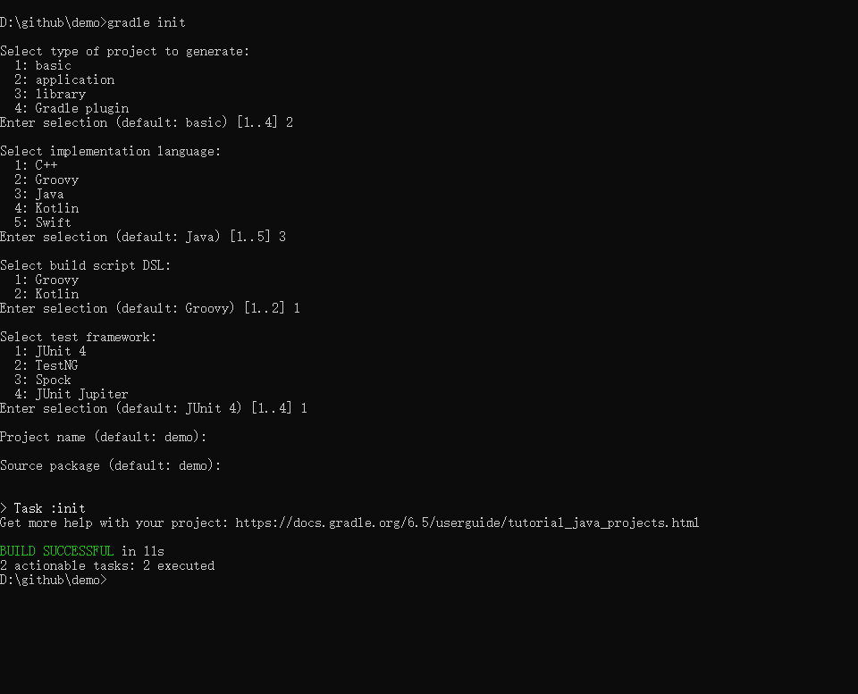
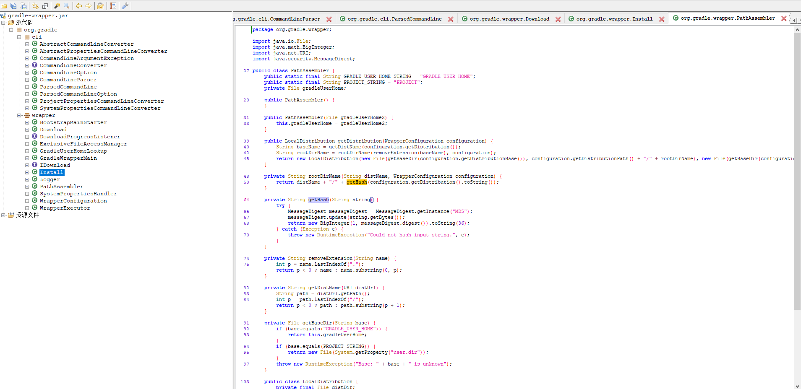
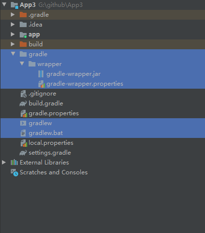

# 手动创建 Gradle 项目


## gradle init

gradle init 通过一个模板来初始化一个gradle项目，可以直接在命令中指定参数也可以直接执行命令后选择参数。

                                           


生成文件树如下


## gradle wrapper

wrapper 是一个脚本命令，调用声明版本的Gradle，如果Gradle不存在则会先下载。这是一种官方推荐的方式，系统无需预先安装Gradle。

常见gradle项目结构如下，包含一个gradle文件夹，gradle下面包含wrapper目录。

- gradle-wrapper.jar：可执行jar，用于解析命令，下载gradle等，会根据下载地址生成一串hash目录名称

  > 

- gradle-wrapper.properties： 定义了gradle存储路径和下载地址，distributionUrl参数指定了gradle下载地址

  > ```
  > #Mon Apr 19 23:05:40 CST 2021
  > distributionBase=GRADLE_USER_HOME
  > distributionPath=wrapper/dists
  > zipStoreBase=GRADLE_USER_HOME
  > zipStorePath=wrapper/dists
  > distributionUrl=https\://services.gradle.org/distributions/gradle-6.5-bin.zip
  > ```




空项目初始化命令，生成对应文件并执行按需gradle下载

> gradle wrapper --gradle-version 6.5 --distribution-type bin --gradle-distribution-url https://services.gradle.org/distributions/gradle-6.5-bin.zip


官方文档 [The Gradle Wrapper](https://docs.gradle.org/current/userguide/gradle_wrapper.html#sec:adding_wrapper)

