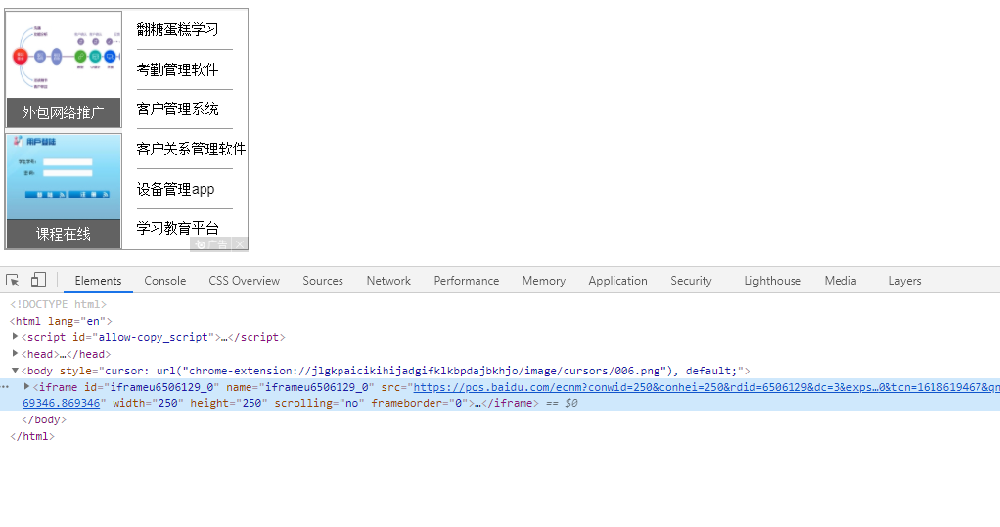
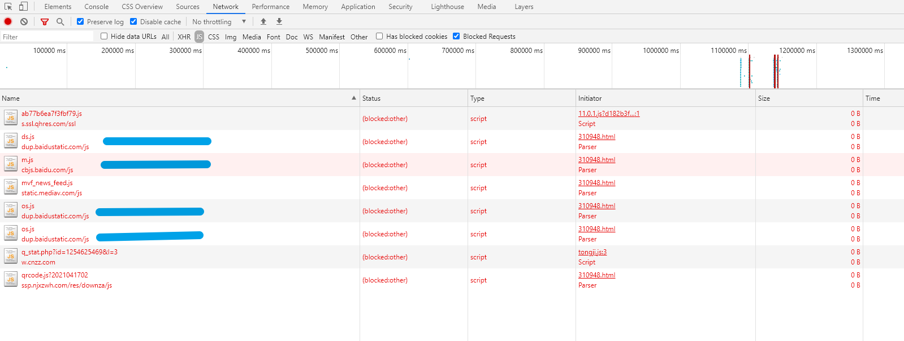
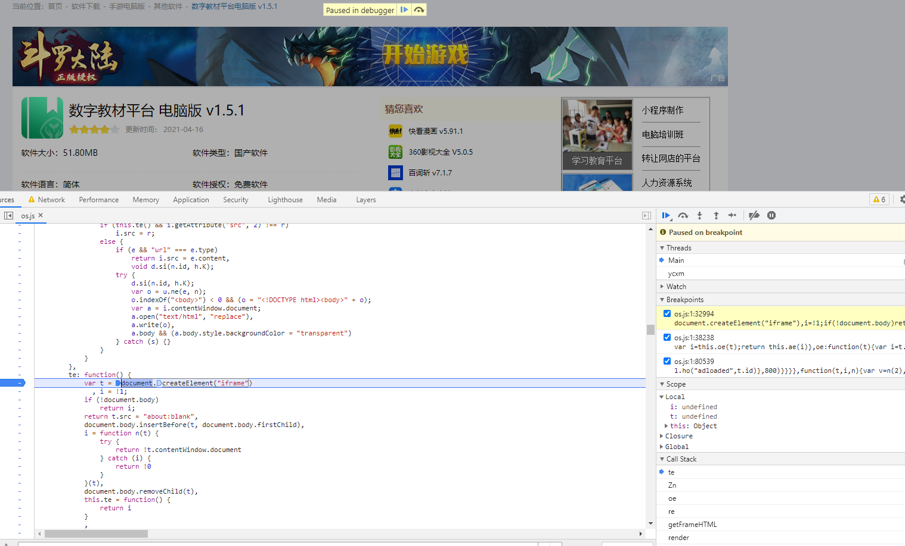
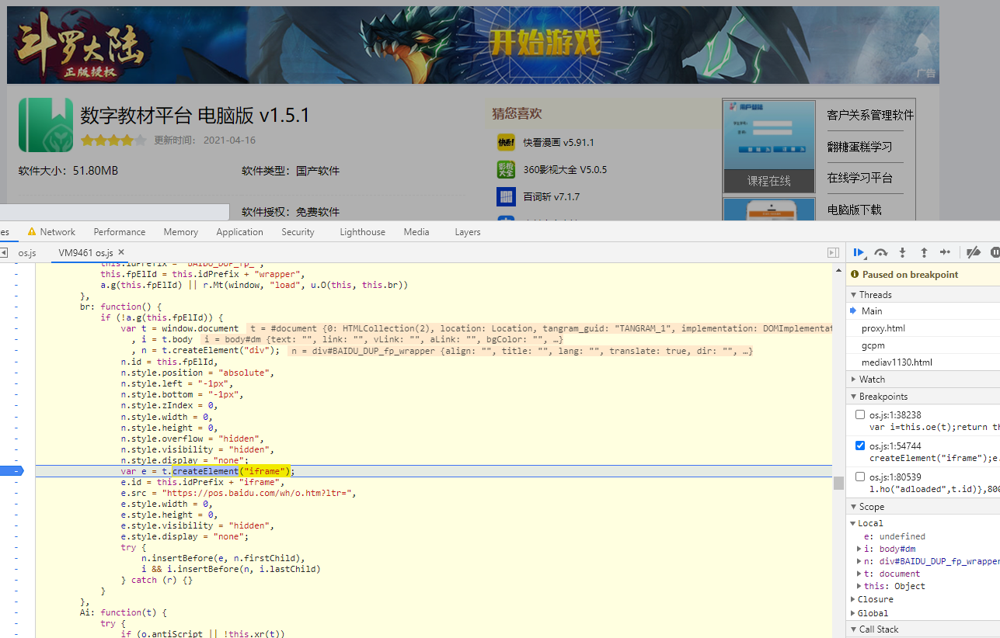
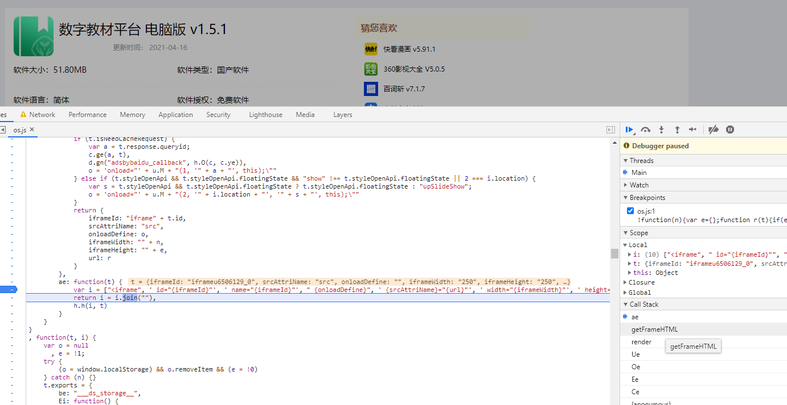
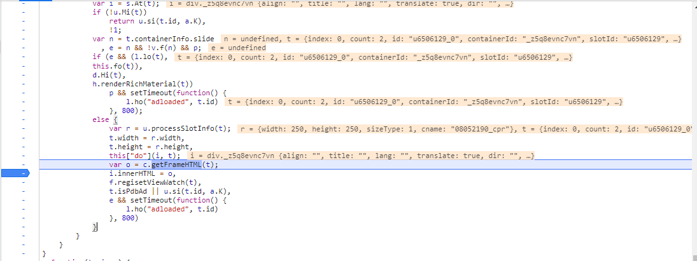

# 如何检测网页广告是否被屏蔽


## 起因

上网闲逛的时候无意中打开了一个新窗口，网页提示广告被屏蔽了，具体内容倒是不重要，关闭插件就能看了，有个问题网页是怎么检测到自己被屏蔽了呢？这就要看看广告插件是怎么过滤的了


## 广告展现形式

常见网页广告有以下种展现形式：

1. 横幅广告(旗帜广告 通栏广告 Banner)

   > 这是最常见的网络广告形式。常用尺寸是486*60(或80)像素(pixels)，以GIF、JPG等格式建立图像文件，放置在网页中。它们大多放在网页的最上面或是最下面。根据统计结果，这是互联网上最流行的广告方式，约占所有互联网广告的60%。

2. 按钮广告(豆腐块广告 Button)

   > 它一般表现为图标。通常是广告主用来宣传其商标或品牌等特定标志的。常用的按钮式广告尺寸有四种：125*125(方形按钮)、120*90、120*60、88*31像素，尺寸偏小，表现手法较简单，容量不超过8K。这类按钮和横幅广告相比所占的面积较小。

3. 对联广告

   > 在页面两侧的空白位置呈现对联形式广告，区隔广告版位，广告页面得以充分伸展，同时不干涉使用者浏览，提高网友吸引点阅，并有效传播广告相关讯息。

4. 弹出窗口广告

   > 在访问网页时，主动弹出的窗口。

5. 页面悬浮广告

   > 在网页页面上悬浮或移动的广告，形式可以为Gif或Flash等格式。

6. 翻卷广告

   > 投放位置固定为频道首页的右上角，不随屏滚动，翻卷角上有明确的“关闭”字样，可以让用户点击后将广告卷回；或者翻卷后自动播放8秒后卷回。该类广告能够迅速迅速吸引浏览者的目光，能让浏览者留下深刻影响。

7. 插页广告(Interstitial Ads)

   > 又称弹跳式广告，广告主选择在自己喜欢的网站或栏目被打开之前插入一个新窗口显示广告内容。插入式广告还指那些在页面过渡时插入的几秒广告，可以全屏显示。但在带宽不足时会影响正常浏览。

8. 赞助广告(Sponsorships)

   > 一般来说赞助广告分为三种形式：活动赞助、栏目赞助及节目赞助，广告主可选择自己感兴趣的网站内容与网站节目进行赞助。

9. 竞赛和促销广告(Contests & Promotions)

   > 广告主可以与网站一起合办网上竞赛或网上促销推广活动，甚至为了提高网民参与的兴趣，还可以用Interactive Games(互动式游戏广告)的方式进行。如在某一页面上的游戏活动开始、中间或结束时，广告都可随之出现，也可以根据广告主的产品要求为之制作一个专门表现其产品的互动游戏广告。

10. 直邮广告(Direct Marketing)

    > 即利用网站电子刊物服务中的电子邮件列表，将广告加在读者所订阅的刊物中发放给相应的邮箱所属人。


这里知道了广告的展示方式，再来简单的了解下广告的加载。这里找了一个百度联盟的广告，看看广告具体是怎么加载到网页的。


## 广告是如何加载进网页的

这里以百度联盟广告为例看看广告是如何加载到网页的，网页广告如下


在广告位置右键打开上下文菜单，选择检查或者快捷键（Ctrl+Shift+I），这时候一般只能看到div或者img元素，往父级元素查找发现是用 iframe 标签加载的。为了减少不必要的请求干扰，这里直接将iframe写入到本地测试页面进行查看。页面运行效果如下



意外的是并没有看到特别的请求，怀疑走错了方向，于是继续往上跟踪看看iframe是如何被添加到网页的，这里借用广告插件的拦截功能，看看具体拦截了哪些请求。刷新网页，打开网络面板，过滤Blocked请求。



百度相关的请求有 4个，关闭广告拦截，手动block请求，逐一排查具体请求js，发现block：http://dup.baidustatic.com/js/os.js 广告会无法加载。找到了加载源点进去查看源码，搜索iframe的创建位置有两处位置

> createElement("iframe")



断点后发现广告已经加载完成，继续往上查找。这里发现iframe的src拼接地址和前面的广告src地址几乎一样，但可惜的是请求参数不同，而且广告已经加载出来了，只能继续其他办法了。



仔细查看iframe属性，发现id和name都是随机的没办法搜索，找到一个iframe的关键属性frameborder

> id="iframeu6506129_0" name="iframeu6506129_0" src="https://pos.baidu.com/gcpm?conwid=250&amp;conhei=250&amp;rdid=6506129&amp;dc=3&amp;exps=110261,110252,110011,110751&amp;psi=cf91e5c99ba4c44a9fc4debe618a63fa&amp;di=u6506129&amp;dri=0&amp;dis=0&amp;dai=2&amp;ps=268x366&amp;enu=encoding&amp;ant=0&amp;aa=1&amp;dcb=___adblockplus_&amp;dtm=HTML_POST&amp;dvi=0.0&amp;dci=-1&amp;dpt=none&amp;tsr=0&amp;tpr=1618622600343&amp;ti=%E6%95%B0%E5%AD%97%E6%95%99%E6%9D%90%E5%B9%B3%E5%8F%B0%E7%94%B5%E8%84%91%E7%89%88%E4%B8%8B%E8%BD%BD_%E6%95%B0%E5%AD%97%E6%95%99%E6%9D%90%E5%B9%B3%E5%8F%B0%E5%AE%A2%E6%88%B7%E7%AB%AFpc%E7%89%88%E4%B8%8B%E8%BD%BD%5B%E5%AD%A6%E4%B9%A0%E6%95%99%E8%82%B2%5D-%E4%B8%8B%E8%BD%BD%E4%B9%8B%E5%AE%B6&amp;ari=2&amp;ver=0415&amp;dbv=2&amp;drs=1&amp;pcs=1903x326&amp;pss=1903x601&amp;cfv=0&amp;cpl=3&amp;chi=1&amp;cce=true&amp;cec=UTF-8&amp;tlm=1618622600&amp;prot=2&amp;rw=326&amp;ltu=http%3A%2F%2Fwww.downza.cn%2Fsoft%2F310948.html&amp;ltr=http%3A%2F%2Fwww.downza.cn%2F&amp;ecd=1&amp;uc=1920x1040&amp;pis=-1x-1&amp;sr=1920x1080&amp;tcn=1618622601&amp;qn=2204d8ea5127c25f&amp;tt=1618622600337.170.170.171" width="250" height="250" scrolling="no" frameborder="0"

搜索后发现三处相关字符串，通过最终定位到render->getFrameHTML->ae



拼接成功iframe元素后直接innerHTML插入到了指定的广告位置



整个广告加载流程大致如下：

1. 网站接入广告SDK并初始化相关参数
2. 广告SDK判断参数以及广告类型并初始化
3. 广告SDK拼接广告地址并添加iframe元素到网页指定位置


当然不同的广告加载方式也有很大的区别，就不列举太多了


## 如何检测广告被屏蔽了呢

广告屏蔽插件会直接阻止网页请求广告地址，如果不能阻止请求地址则会通过规则删除广告元素或者隐藏，不同广告插件功能有所不同。


最简单的方式就是在自己的网页中加载一段广告，然后检测广告元素是否存在来判断是否被屏蔽。


可以查看公共的过滤规则然后找到大众化的广告拦截方式，用来判断是否被屏蔽。下面简单利用了拦截规则，匹配到/fage/ad.js的请求会被拦截。


```html
<!DOCTYPE html>
<html lang="en">
<head>
    <meta charset="UTF-8">
    <title>Title</title>
    <script src="./fage/ad.js"></script>
    <script type="text/javascript">
        window.onload = function () {
            if (window.adLoad) {
                document.body.innerText = '广告加载成功'
            } else {
                document.body.innerText = '广告被屏蔽'
            }
        }
    </script>
</head>
<body>

</body>
</html>
```

ad.js 文件内容很简单

```javascript
window.adLoad = true
```


### 小结

本文简单讲了一下广告的加载方式以及被屏蔽的检测方法，不同广告的加载和检测方式都不相同，实际使用可能还需要做更多适配，也不是所有的广告插件都有/fage/ad.js这个拦截规则。